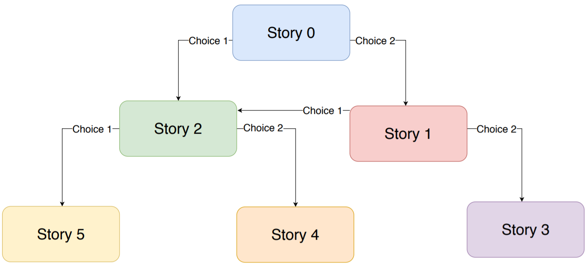
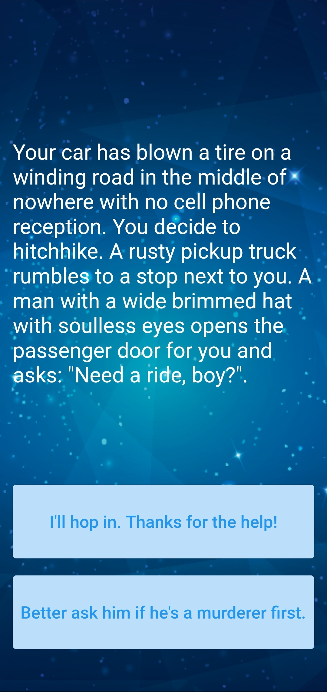
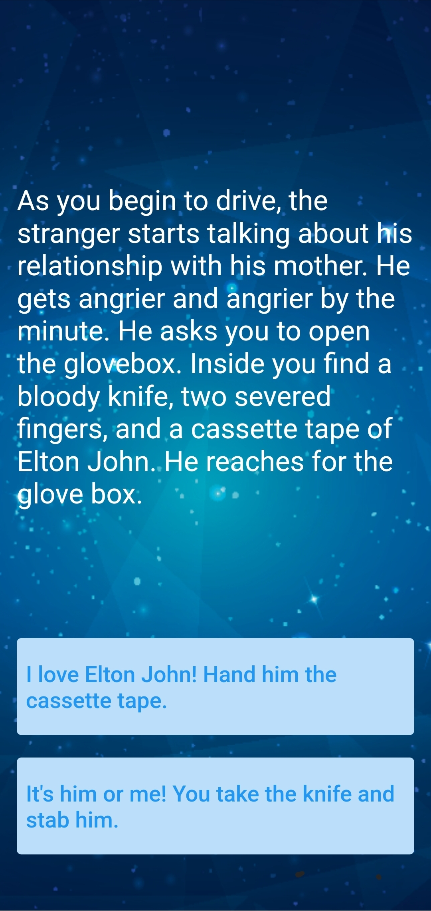
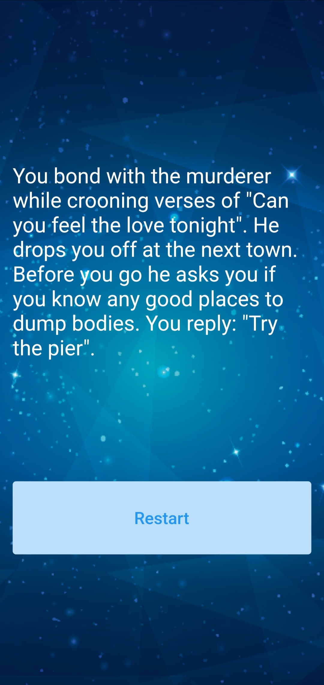

# Destini 🤔 - Project for practice

Building a choose your own adventure game like Bandersnatch.

 

## Lesson goals

- apply your knowledge from the last module (Quizzler) to use Dart OOP principles to build a well organised project using given story flow.

  

## App Final UI

| | | |
| --- | --- | --- |
|  |  |  |
