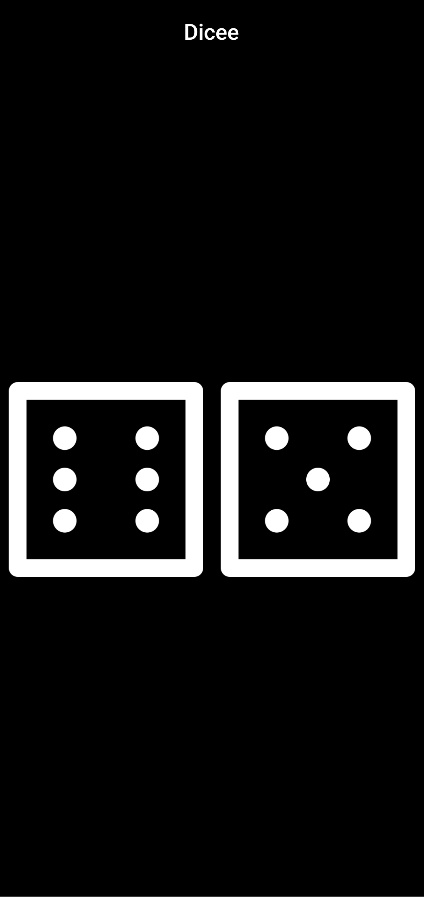
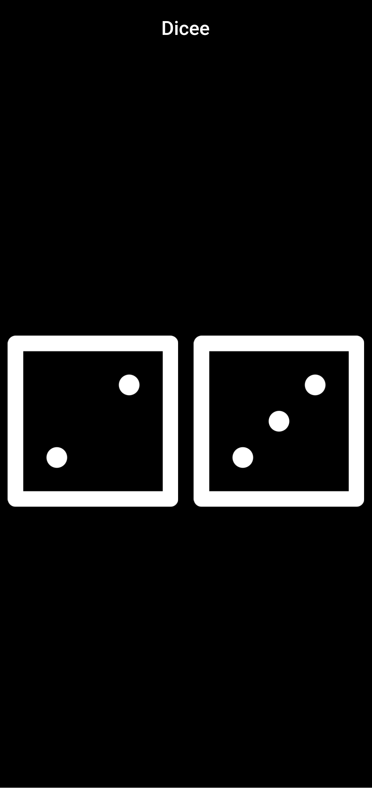
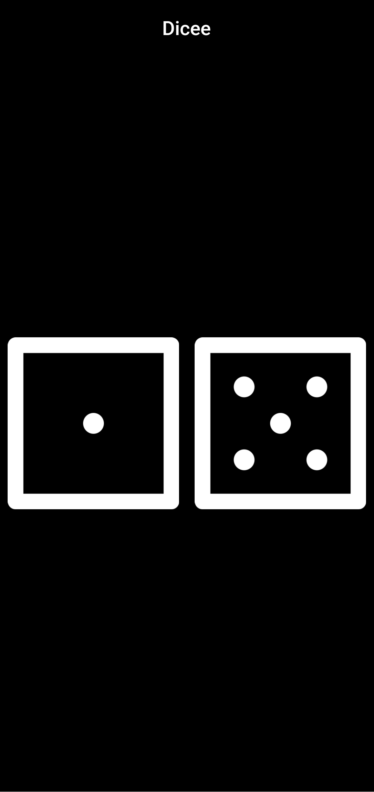

# Dicee 🎲 - Building Apps with State

We’re going to make a Las Vegas dice app. You can make the die roll at the press of a button. With this app in your pocket, you’ll be able to settle any score on the go!

 

## Lesson goals

- Understand the difference between Stateful and Stateless Widgets and when they should each be used.
- Understand how callbacks can be used detect user interaction in button widgets.
- Understand the declarative style of UI programming and how Flutter widgets react to state changes.
- Learn to import dart libraries to incorporate additional functionality.
- Learn about how variables, data types and functions work in Dart 2.
- Build flexible layouts using the Flutter Expanded widget.
- Understand the relationship between setState(), State objects and Stateful Widgets.

  

## App Final UI

| | | |
| --- | --- | --- |
|  |  |  |