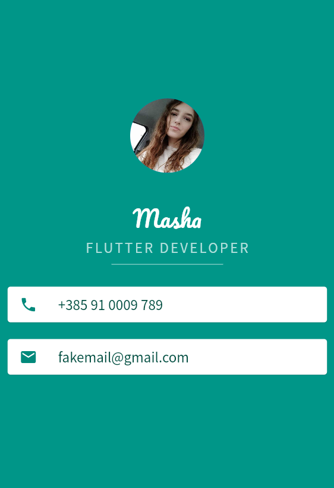

# MiCard - How to Build Beautiful UIs with Flutter Widgets

Mi Card is a personal business card. Imagine every time you wanted to give someone your contact details or your business card but you didn't have it on you. Well, now you can get them to download your business card as an app.

 

## Lesson goals

- Understand the difference between Stateful and Stateless Widgets and when they should each be used.
- Understand how callbacks can be used detect user interaction in button widgets.
- Understand the declarative style of UI programming and how Flutter widgets react to state changes.
- Learn to import dart libraries to incorporate additional functionality.
- Learn about how variables, data types and functions work in Dart 2.
- Build flexible layouts using the Flutter Expanded widget.
- Understand the relationship between setState(), State objects and Stateful Widgets.

  
## App Final UI

