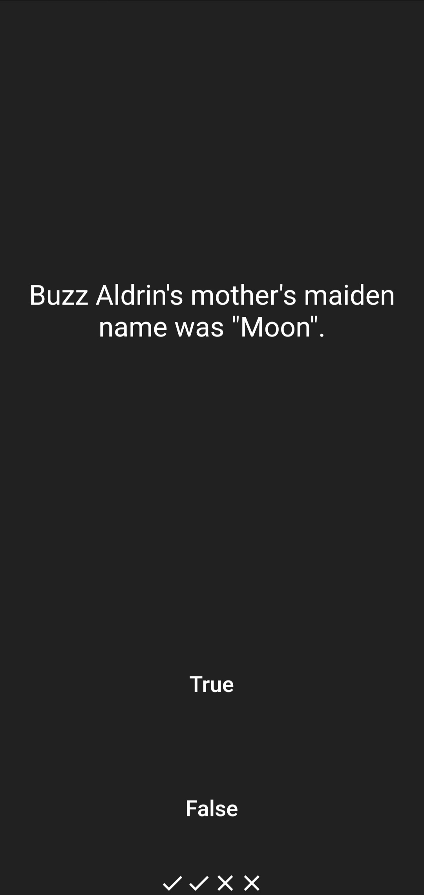
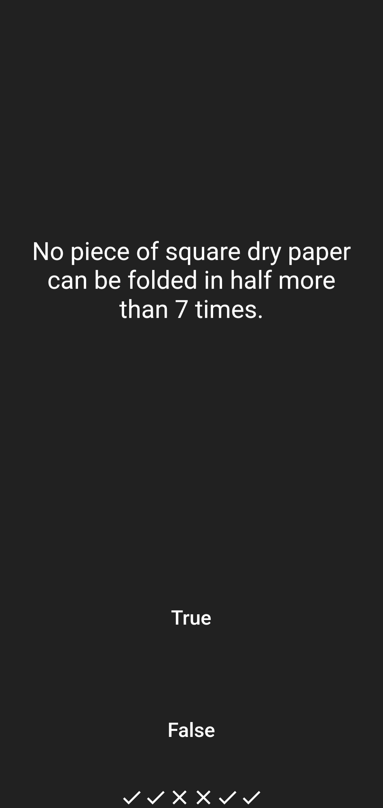

# Quizzler ❓ - Modularising & Organising Flutter Code

A quiz app that tests your general knowledge. As one of the most popular types of apps on the app stores, you can create your own quiz for other people to enjoy!

 

## Lesson goals

- Learn about how lists and conditionals work in Dart.
- Learn about classes and objects in Dart and how it apply to Flutter widgets.
- Understand Object Oriented Dart and how to apply the fundamentals of OOP to restructuring a Flutter app.
- Learn to use Dart Constructors to create customisable Flutter widgets.
- Apply common mobile design patterns to structure Flutter apps.
- Learn about structuring and organising Flutter apps.

  

## App Final UI

| | | |
| --- | --- | --- |
|  |  |  |
|  |  |  |
